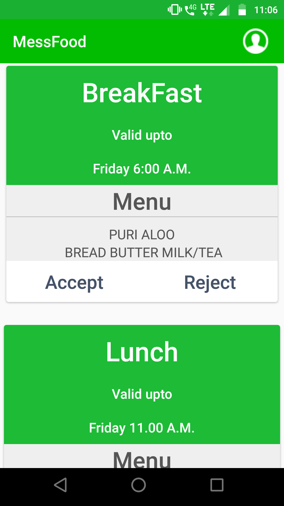
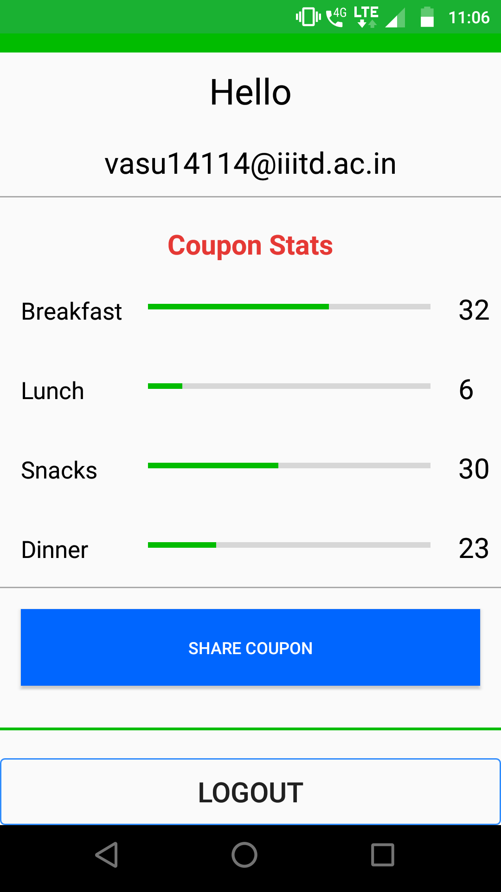
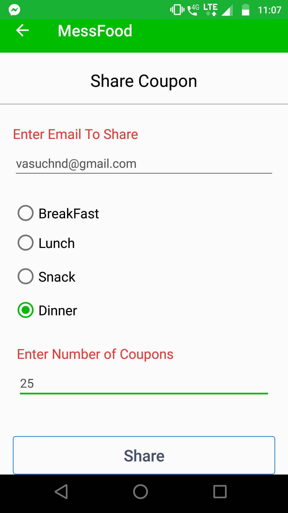
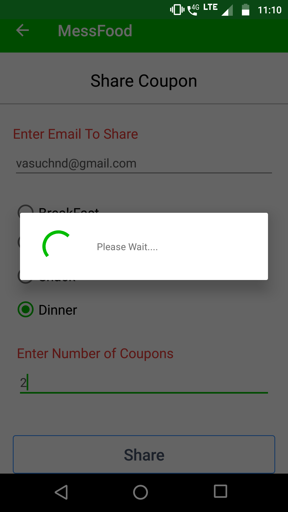

# MessFood
When you are living apart from family you buy coupons for food for breakfast,lunch and dinner .So when you don't come for 
meal food get waste . This is an android for college mess manager to know them how many peoples are coming for meal for breakfast ,lunch or dinner.
This gives a count to cook so that he makes food for people according to estimation.
This app solely based on user study what they want in app , what options should be there , how easily to navigate between screens and better UI/UX.

App Contains four card breakfast , lunch , evening snacks , dinners . Each card is having menu items and timer to response. Every card updated after deadline passed with provided menu for next day .
The order of card is as per upcoming event (breakfast,lunch,dinner) . You can share your coupons amongs your friends circle.

###### Home page

###### Student Details

###### Coupon Sharing

###### Coupon Sharing

